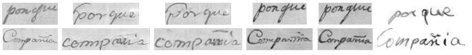

# Evaluación Comparativa de Modelos de Síntesis de Escritura en Español



## 📋 Descripción
Este repositorio contiene la evaluación comparativa de tres modelos generativos para síntesis de texto manuscrito en español, con enfoque en caracteres de baja frecuencia (como el ñ) y adaptación de estilo con datos limitados.

## 📊 Dataset
El proyecto utiliza dos fuentes de datos principales:

- **IAM Corpus**: Base de datos pública de oraciones para reconocimiento de escritura manuscrita, con 1,550 autores y 111,495 palabras.
- **Causas Criminales**: Archivo regional de Cusco, Perú - manuscritos históricos en español del siglo XVIII-XIX. El único documento transcrito disponible fue usado para evaluación.

La combinación permite evaluar modelos tanto en vocabulario como en español con caracteres especiales (ñ, acentos).

## 📥 Modelos (Google Drive)
| Modelo | Archivo | Descripción |
|--------|---------|-------------|
| DiffusionPen | `diffusionpen.pt` | Modelo global diffusionado |
| DiffusionPen (finetuning) | `diffusionpen_finetuning.pt` | Fine-tuning con autor específico |
| FW-GAN | `fw_gan.pt` | Modelo GAN frequency-driven |
| FW-GAN (finetuning) | `fw_gan_finetuning.pt` | Fine-tuning con autor específico |
| VATr-pp | `vatr-pp.pt` | Modelo transformer-based con atención |

[Enlaces completos de Google Drive](https://drive.google.com/drive/folders/1b8iwhMG-BqQJ218CAc14d4hM2giEdUWN?usp=drive_link)

## 📊 Resultados Comparativos
| Modelo | CER$_g$ ↓ | CER$_{\tilde{n}}$ ↓ | ñ→n Confusion ↓ | Base |
|--------|-----------|-------------------|-----------------|------|
| FW-GAN (global) | 0.513 | 0.609 | 91.0% | GAN |
| FW-GAN (adapt.) | 0.393 | 0.679 | 45.0% | GAN + Fine-tuning |
| DiffusionPen (global) | 0.696 | 0.901 | 63.0% | Diffusion |
| DiffusionPen (adapt.) | 0.703 | 0.837 | 62.0% | Diffusion + Fine-tuning |
| VATr-pp$^{\dagger}$ | 0.197 | 0.448 | 57.0% | Transformer + Few-shot |

$^{\dagger}$Usa 15 referencias reales en inferencia; ver Sec. de modelos.

## 🚀 Quick Start por Proyecto
Guía paso a paso con entornos virtuales, sincronizada con los parámetros de cada README individual:

### DiffusionPen
```bash
# 1. Crear entorno virtual
python -m venv .venv

# 2. Activar entorno
source .venv/bin/activate

# 3. Instalar requerimientos
pip install -r DiffusionPen/requirements.txt

# 4. Generar muestras (15 samples, 5 referencias de estilo)
python3 scripts/generate_from_txt.py \
  --checkpoint ./runs/global_bilingual/models/best_ema_unet.pt \
  --stable_dif_path ./models/base/stable-diffusion-v1-5 \
  --style_path ./style_models/mixed_spanish_mobilenetv2_100.pth \
  --dataset_root ./dataset \
  --writer_map ./writers_dict_train.json \
  --writer 1539 \
  --style_manifest ./runs/style_1539_k15/writer_1539_refs_k15.txt \
  --num_style_samples 15 \
  --input ./generar.txt \
  --output ./output \
  --sampling_steps 50 \
  --cfg_scale 2.5 \
  --max_text_len 64 \
  --seed 42
```

### FW-GAN
```bash
# 1. Crear entorno virtual
python -m venv .venv

# 2. Activar entorno
source .venv/bin/activate

# 3. Instalar requerimientos
pip install -r FW-GAN/requirements.txt

# 4. Generar muestras
python3 generate.py \
  --config configs/fw_gan_global_es.yml \
  --ckpt runs/global_80/ckpts/best.pth \
  --input_txt generar.txt \
  --output output/global \
  --writer_id 1539 \
  --style_split train
```

### VATr-pp
```bash
# 1. Crear entorno virtual
python -m venv .venv

# 2. Activar entorno
source .venv/bin/activate

# 3. Instalar requerimientos
pip install -r VATr-pp/requirements.txt

# 4. Generar muestras
python3 generate.py text \
  --checkpoint files/vatrpp.pth \
  --style-folder files/style_samples/00 \
  --num_examples 15 \
  --text-path generar.txt \
  --output output/
```

## ⚙️ Requisitos
- **Python**: >=3.8
- **PyTorch**: >=2.0.0 (recomendado con CUDA 11.7+ para GPU)
- **VRAM**: Mínimo 8GB para generación, 24GB recomendado para training
- **Dependencias**: Ver `requirements.txt` de cada proyecto

## 📄 Citation
Citations a los papers originales:
- **DiffusionPen**: Nikolaidou et al. 2024 (ECCV)
- **FW-GAN**: Khoa et al. 2026 (Expert Systems with Applications)
- **VATr-pp**: Vanherle et al. 2024 (IEEE TPAMI)

## 📬 Contacto y Repositorio
- **GitHub**: https://github.com/koninik/DiffusionPen, https://github.com/DAIR-Group/FW-GAN, https://github.com/EDM-Research/VATr-pp
- **Google Drive**: [Folder de modelos](https://drive.google.com/drive/folders/1b8iwhMG-BqQJ218CAc14d4hM2giEdUWN?usp=drive_link)